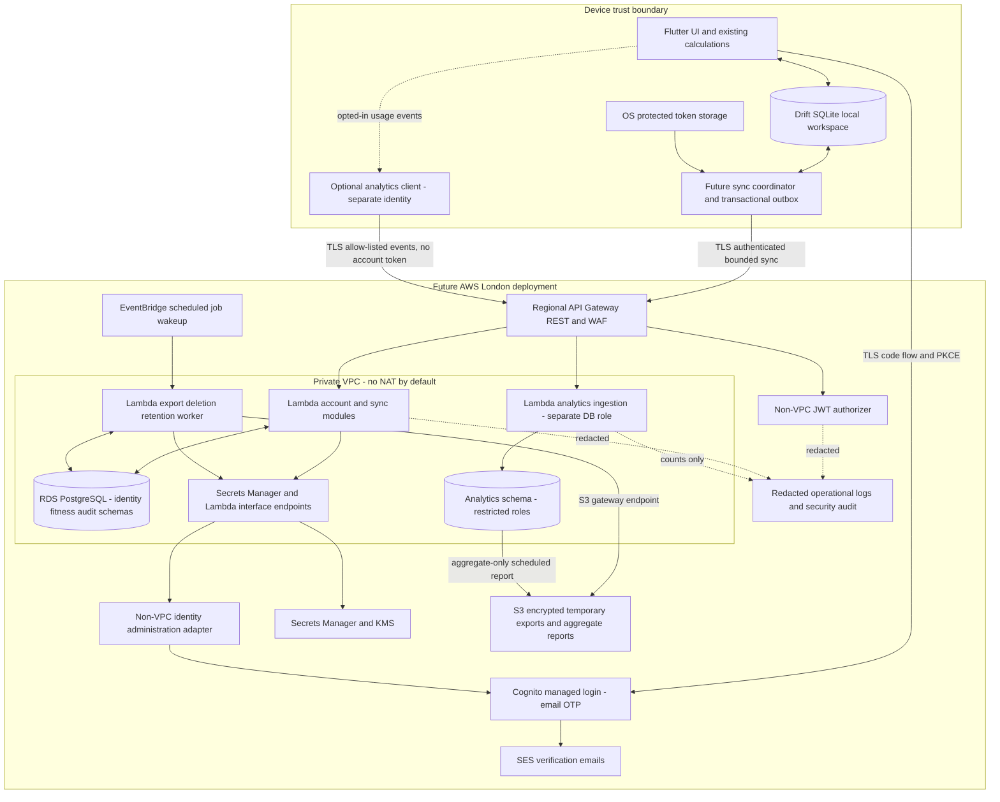

# Noryva Phase 2A — architecture and security design

> **9 September 2026 founder review:** The [Phase 2B validation report](phase-2b-validation.md) supersedes this proposal's REST-first decision and permanent staging budget/topology assumptions. HTTP API is selected for the foundation; staging is local-first with cloud database infrastructure disabled by default. The age-inference finding below remains unchanged. No AWS resource changes or automatic Phase 2C progression are authorised.

**Status:** design proposal; no Phase 2 implementation authorised by this document.  
**Reviewed:** 6 September 2026. **Audience:** founder and future implementation/security reviewers.  
**Scope:** optional accounts, backup/restore, multi-device sync, privacy controls and optional first-party analytics. No advertising, subscriptions, Health Connect, branded-food integration or changes to Phase 1 calculations.

## 1. Executive summary

Keep Flutter and SQLite/Drift as the primary user experience. An account must never be a prerequisite for onboarding, tracking, food search, diary access or local export. All food logging succeeds locally before any network operation. Cloud or identity-provider failure must leave local tracking usable.

Recommended initial cloud: one modular backend deployed as a few AWS Lambda handlers, a Regional API Gateway **REST API**, Cognito Essentials with email OTP, private RDS PostgreSQL, encrypted temporary S3 exports, and narrowly scoped background jobs. Use London (`eu-west-2`), separate staging/production AWS accounts, Terraform and GitHub OIDC. Avoid an ALB, always-on Fargate, NAT gateways, Redis and a streaming platform initially. Use REST rather than the cheaper HTTP API for direct regional WAF integration; reassess this small marginal request cost at scale.

Cloud data is encrypted in transit and at rest but **server-readable** under this proposal. It is not end-to-end encrypted or zero knowledge. This is a founder approval gate: E2EE would materially change key recovery, validation, exports and the sync design and must be designed before implementation if required.

Do not sync exact DOB or age fields, or unfinished onboarding drafts. Sync the completed body/goal profile and saved calculation/target snapshot, with explicit user agreement. A restored device can use the saved plan immediately; it asks for DOB locally only when recalculation is requested. Treat fitness and diary data as potentially special-category health data pending specialist review. Excluding DOB/age fields does not prevent age inference: exact BMR, height, weight, calculation sex and the known Mifflin–St Jeor equation reveal the age used in the saved calculation. Preserving that snapshot therefore needs explicit necessity review; preventing this inference would require a separately approved reduction of reconstructive fields.

Analytics are a separate optional subsystem, off by default, with strict event/property schemas and a separate pseudonymous identifier. No health values, food names, search strings, email, account IDs, session replay or advertising identifiers may enter it. Product analytics access must not grant access to fitness records.

Indicative recurring budgets, not London price quotes: synthetic staging **USD 76–150/month**; early production with a Multi-AZ database **USD 137–275/month**, before tax/support and subject to the assumptions in section 19. Database capacity and private endpoints dominate this design. Approval of this plan does not authorise creating these resources.

## 2. Current-state assessment

### Evidence and scope

This assessment used the **working tree**, including existing Phase 1/1.1 uncommitted changes, not just Git HEAD `3ef7ebab01c932931074679b90fa601df2bcfc4e`. An independent read-only architecture pass reviewed mobile storage, ownership assumptions, native configuration and CI. It was an architecture review, not a vulnerability scan or penetration test.

Inspected-scope SHA-256 before this document: `231b44cec15a6d31e6c5e1ceebb2c8fa98bec9da121cbfab70e3769ab1b7e785` (sorted path/content-digest manifest covering 113 existing application, native, test, CI and documentation files). Existing working-tree changes are not changes made by Phase 2A.

| Area | Current implementation and evidence | Boundary to preserve or introduce later |
|---|---|---|
| Structure | `apps/mobile/lib/{app,core,design_system,features}`, `apps/mobile/test`, Android/iOS scaffold, `docs`, `.github/workflows`; no `backend/` or `terraform/` | Keep feature-first mobile structure. Proposed backend/IaC directories are documentation only. |
| Startup/Riverpod | `apps/mobile/lib/main.dart:3`, `apps/mobile/lib/app/bootstrap.dart:9`: open database, inject through `ProviderScope`. `apps/mobile/lib/core/database/app_database.dart:16`: plain database provider; `apps/mobile/lib/app/router.dart:12`: router provider | Small direct provider graph, not a generic repository framework. Introduce separate session, sync coordinator and network adapter providers only where needed. |
| Presentation/data access | `apps/mobile/lib/features/home/presentation/home_screen.dart`, `apps/mobile/lib/features/diary/presentation/diary_screen.dart`: widgets read local data with FutureBuilders; food screen writes directly to AppDatabase | Keep local reads. Centralise future mutation + outbox transactions at the database boundary, not inside UI networking callbacks. |
| Drift | `apps/mobile/lib/core/database/app_database.dart:119`: supported generated Drift database; `:124`: schema **3**; `:126`: application documents directory + `noryva.sqlite` via NativeDatabase | Preserve generated code, migrations, seed and query behaviour. Future sync metadata needs additive, explicitly tested migrations. |
| Migrations | `apps/mobile/lib/core/database/app_database.dart:145`: v1→v2 adds food basis unit and servings; pre-v3→v3 adds nullable `body_draft` | `test/features/database_migration_test.dart` covers v1 and v2 to current schema without destroying profile/diary. Do not implement the next migration in 2A. |
| Anonymous identity | `apps/mobile/lib/core/database/app_database.dart:167`: first profile or UUIDv4, persisted until reset | Local UUID is a data label, **not authentication**. Never accept it as server ownership proof, never reuse it as an analytics ID. |
| Profile/onboarding | `apps/mobile/lib/core/database/app_database.dart:22`; `features/onboarding/presentation/onboarding_flow.dart`: sex, DOB, canonical cm/kg, goals, activity, plan, unit drafts/resume | Preserve onboarding before accounts, controllers, unit conversions and optional local-only use. Sync a completed explicit DTO, not the profile SQL row or draft JSON. |
| Calculations | `features/goals/domain/energy_calculator.dart`: pure Mifflin–St Jeor/targets; `features/onboarding/domain/body_details.dart`: conversion and entry validation | No duplicate server calorie engine. Cloud stores the existing calculation snapshot and a future algorithm version label. |
| Diary/snapshots | `apps/mobile/lib/core/database/app_database.dart:95`, `:348`: UUIDv4 diary IDs, local owner, optional food FK, name/brand/serving and nutrient snapshots, UTC timestamps. `:399`: edits rescale snapshots | Preserve stable IDs and historical values. Cloud records remain readable without a food catalogue match. |
| Search/food data | `features/foods/domain/food.dart`, database search/sections and seed: 30 bundled demo foods; per-100 g/ml nutrition; recent foods derived from diary | Do not upload searches, change ranking or migrate the seed catalogue to a cloud dependency. |
| Current ownership assumption | `app_database.dart:196`, `:213`: profile updates assume one profile. `:374`, `:388`, `:425`: date/id-based diary access, no account partition | Safe design assumption for one local workspace; not a multi-account model. Future account switching must explicitly detach/replace a workspace. |
| Reset | `app_database.dart:436`: transactional profile/diary removal, new identity, retained seed catalogue | Logical deletion, not proof of secure erasure or deletion of OS backups. Local reset must remain distinct from cloud deletion. |
| Navigation | `apps/mobile/lib/app/router.dart`: onboarding gate based on local completion; Home, Diary, Progress, Me shell; food route | Add future account/privacy flows under Me. No authentication redirect around the main shell. |
| Design system | `design_system/tokens/tokens.dart`, `theme/theme.dart`, `components/nutrition_components.dart`, `app/app.dart`: light/dark tokens, system theme and reusable nutrition/meal components | Reuse these for account/privacy screens; no redesign of working screens required. |
| Tests/acceptance | 41 passing tests in the current accepted baseline: calculations, servings, real-file persistence, migrations, onboarding keyboard/unit/DOB/resume tests, journey/navigation, themes, semantics, contrast and 160% scaling | User reports manual Android and force-stop/reopen acceptance. 2A does not rerun or alter the app. These tests become mandatory regression gates for future phases. |
| CI | `.github/workflows/flutter.yml:2`: PRs and main pushes; checkout/Flutter setup, pub get, format check, analyze, test. Actions use version tags, stable Flutter floats, no explicit workflow permissions | Add pinned versions/SHAs, explicit permissions, APK/release/security/IaC jobs later. Effective current GitHub token permissions depend on repository/org settings not inspected here. |
| Native/release | `android/app/src/main/AndroidManifest.xml:2`: no requested main-manifest permissions; debug/profile INTERNET supports tooling. `android/app/build.gradle.kts:31`: release currently uses debug signing for local builds | Production signing and validated backup policy are gates, not completed production controls. No auth/sync/analytics dependencies or application network calls observed. |

**Documentation gaps:** `docs/DATA_MODEL.md`, `docs/DECISIONS.md` and `docs/TESTING.md` still describe schema 2/older unit support. Source is authoritative for this assessment; those files are intentionally not edited by this task.

**Security/privacy limits of the current baseline:** NativeDatabase has no application-level encryption configured. The inspected Android manifest has no explicit backup/data-extraction exclusions, and the iOS scaffold has not established a tested equivalent policy. “Only on this device” is stronger than the source evidence of “no app-originated transmission.” Android Auto Backup and device transfer require explicit policy and device testing, not an assumption. The existing food-write error handler prints error/stack details locally; future remote diagnostics must not inherit it blindly. [Android backup guidance](https://developer.android.com/identity/data/autobackup)

## 3. Product decisions

| Decision | Proposed rule |
|---|---|
| Account optionality | Local feature set works with no account and no network. Me → Back up & sync is the only invitation, with a clear local-only alternative. |
| Account purpose | Backup, restore, multi-device sync and recovery only. No account-driven tracking restrictions or promotional UI. |
| Encryption promise | TLS + managed encryption at rest. Explain server readability. E2EE is an unresolved approval decision, not an implied property of KMS. |
| Sync scope | Completed profile/plan and diary snapshots; no DOB/age fields, draft fields, search history, catalogue bulk copy or analytics preference shared across devices. |
| Age/DOB | Keep exact DOB locally; retain the existing supported age range locally. No cloud DOB is required for identity verification. Saved calculation inputs/BMR can reveal calculation age; do not promise age secrecy. Restore does not silently invent a DOB. |
| Availability | Cloud is eventually consistent; no “instant across every device” promise. Mobile foreground sync is primary; OS background execution is best effort. |
| Privacy defaults | Cloud off; analytics off independently; no ads or advertising trackers. Core security logging is minimised and disclosed separately. |
| Account switching | One active local workspace. Never silently upload one person’s retained local records into another account. |
| Catalogue | Phase 2 keeps the existing local seed/search behaviour. Phase 3 has a separate catalogue/provenance boundary. |
| Legal gate | Approve lawful bases, Article 9 condition where applicable, DPIA, retention and transfers before a real-user cloud pilot. |

## 4. Architecture diagram

All remote elements below are **proposed**. “Private” describes network reachability, not immunity from authorised operator access.



Single backend codebase with modules and separate runtime roles, not independent microservices. The API must route analytics to its own handler without an account authorizer or account cookies. The diagram’s two database cylinders are initially logically separate schemas on one RDS instance; this saves cost but does **not** isolate them from a DBA or database-wide breach. A dedicated analytics database can follow if the DPIA requires stronger isolation.

## 5. AWS service decisions

| Service/alternative | Recommendation and rationale |
|---|---|
| API Gateway REST + Lambda | Initial choice: request-driven costs, managed TLS/ingress, bounded functions; direct regional WAF. Strict validation still occurs in application handlers. |
| API Gateway HTTP API | Cheaper and simpler JWT support, but AWS’s current comparison excludes direct WAF integration. Rejected initially to avoid a CloudFront/WAF workaround and alternate-origin bypass complexity. [AWS API comparison](https://docs.aws.amazon.com/apigateway/latest/developerguide/http-api-vs-rest.html) |
| ECS/Fargate + ALB | Good future container host and matches founder expertise; choose when sustained load, long-running jobs or Lambda constraints justify it. At launch, minimum tasks, ALB, IPs and egress infrastructure charge while idle. Keep domain/services independent of Lambda adapters to permit a later port. |
| RDS PostgreSQL | Managed relational transactions fit ownership, idempotency, jobs and ordered changes. Use a supported engine version, encrypted gp3 storage, private subnets and automated backups. Multi-AZ recommended for paid/public reliability expectations; Single-AZ acceptable for synthetic staging or an explicitly accepted limited pilot. |
| RDS Proxy | Defer initially with small reserved Lambda concurrency and small connection pools, tested against database limits. Add if connection pressure/failover behaviour warrants the extra fixed cost; not a substitute for backpressure. |
| Aurora Serverless/Data API | Evaluate if workload or connection economics change; not assumed cheaper at sustained load. Different pricing, scaling floors, supported versions and restore behaviour need a fresh benchmark. |
| DynamoDB as primary store | Operationally attractive, but rejected for this first design: relational privacy jobs, conflict receipts and PostgreSQL familiarity outweigh eliminating the DB fixed cost. No dual-write authoritative datastore. |
| Cognito Essentials | Managed identity lifecycle and native passwordless options. No Cognito identity pool: mobile calls Noryva API, not AWS with IAM credentials. Do not put fitness attributes into Cognito. |
| Application-managed auth | Reject for initial release: challenge abuse, token/session security, recovery and passkey support create a substantial security burden. A custom magic-link service is not “just sending email.” |
| SES | Cognito delivery integration; verify domain, DKIM/SPF/DMARC and production sending access before launch. No health details in messages; no marketing list. Delivery metadata remains personal and has retention requirements. |
| S3 | Private, Block Public Access, SSE-KMS exports, short access grants, no public website bucket. Separate aggregate-only dashboard/report bucket and security archive prefix/bucket. |
| Secrets Manager/KMS | Rotate DB/application secrets, distinct staging/prod keys, narrow secret/KMS permissions. Use service-integrated encryption for RDS/S3/logs. No per-account key destruction promise in a shared database. |
| CloudWatch/CloudTrail | Bounded logs, metrics, alarms; security/admin trail separately retained and access-controlled. Disable body/SQL parameter logging. Avoid X-Ray payload capture and broad SDK telemetry initially. |
| WAF | Small managed/bounded ruleset and rate-based rules on API and supported Cognito surface; no expensive Bot Control by default. Disable sampled request payloads and redact auth/cookies/query/body. WAF is not an ownership control. |
| ALB/CloudFront | No ALB required for Lambda. No CDN for private fitness responses. Use ACM and Route 53 for the regional API domain; restrict alternate routes and configure WAF on the actual exposed stage. |
| Jobs | Durable PostgreSQL job rows + EventBridge-triggered bounded workers. No SQS/Step Functions required initially. Jobs checkpoint/retry in DB; later introduce a queue only when measured throughput warrants it. |

### Private connectivity without an accidental NAT dependency

VPC Lambdas connect to RDS over TLS with hostname verification and a current CA bundle. Provide Secrets Manager interface endpoints in two AZs and an S3 gateway endpoint. The API needs no arbitrary internet egress. A **non-VPC** Lambda authorizer fetches/caches Cognito JWKS; the VPC handlers trust only API Gateway’s verified authorizer context, then check live database account/device state.

Identity administration (verified bootstrap lookup, revoke/disable/delete) uses a small non-VPC adapter invoked through a Lambda interface endpoint. Its request allow-list contains provider subjects and job IDs only except a transient user token when provider verification requires it; tokens never enter persistent jobs/logs. It has no fitness DB access. VPC workers use a narrow invoke role, not general internet access. Scheduled retries handle ambiguous provider responses idempotently.

Lambda runtime log delivery is managed by Lambda; arbitrary SDK calls from VPC code still need routes/endpoints. S3’s KMS integration does not require client-side KMS calls. If future application envelope encryption, SQS or direct Cognito SDK calls are added inside the VPC, first price and validate their endpoints. Putting Lambda in a public subnet does not give it a public IP. This endpoint inventory is a required 2B connectivity test. [Lambda VPC networking](https://docs.aws.amazon.com/lambda/latest/dg/configuration-vpc-internet.html), [Secrets Manager private access](https://aws.amazon.com/blogs/security/how-to-connect-to-aws-secrets-manager-service-within-a-virtual-private-cloud/)

## 6. Account/auth design

### Authentication choice

Recommend **Cognito managed login, email OTP, public mobile client, authorization code + PKCE**, with email as the only requested contact attribute. Use the system browser and verified HTTPS app links/callbacks; validate state, nonce, issuer and exact redirect URI. Never embed a client secret in Flutter. Validate the chosen Cognito managed-login/Flutter integration in 2C before committing to an SDK.

| Method | Evaluation |
|---|---|
| Email OTP | Recommended starting point: familiar, works across devices, avoids link scanners consuming login links. Still phishable and only as secure as the mailbox; rate-limit attempts/sends and resend cadence. |
| Email magic link | Rejected initially: interception, inbox previews/link scanners, same-device/cross-device ambiguity and deep-link hijacking. If revisited: high-entropy one-use challenge, short lifetime, hashed storage, explicit POST completion, PKCE/browser binding, no state-changing GET, no token in logs/referrers. |
| Passkeys | Preferred stronger future sign-in factor once recovery and platform support are validated. Do not require them for first backup. Email fallback weakens account takeover protection; explain this rather than calling the whole account phishing-resistant. |
| Password + MFA | Viable fallback if provider/platform constraints block passwordless; requires separate approval and credential-stuffing controls. Do not silently introduce passwords in implementation. |
| Social login | Not required; defer Google/Facebook and additional provider/linking complexity. |

Current Cognito Essentials supports managed login, OTP and passkey/choice-based capabilities. OTP/MFA combinations have configuration restrictions; do not assume “email OTP plus mandatory MFA” works as desired. AWS’s current passkey/MFA documentation is evolving; validate exact pool configuration, user-verification behaviour, region and client SDK in 2C. [Cognito Essentials](https://docs.aws.amazon.com/cognito/latest/developerguide/feature-plans-features-essentials.html), [MFA configuration](https://docs.aws.amazon.com/cognito/latest/developerguide/user-pool-settings-mfa.html)

### Lifecycle

1. **Local-only:** install → onboarding → normal use. No auth initialization request, remote UUID registration or background health transmission.
2. **Invitation:** Me → Back up & sync explains what is uploaded, DOB-field exclusion and calculation-age inference, encryption model and recovery. Optional analytics is separate, unselected and not bundled with account terms.
3. **Creation/verification:** provider verifies email. API verifies the access token and obtains authoritative verified-email status through the identity adapter; never accept a client `email_verified` field. Create account UUID by unique `(provider_issuer, provider_subject)` in an idempotent transaction. Email is not a relational key. Do not create an account merely because an unverified email was submitted.
4. **Binding:** register a random per-account device UUID plus a server-issued opaque device-session credential; store only its hash server-side. Give the device a dataset epoch and explicit initial-upload status. Local install UUID stays local.
5. **First upload:** user confirms “Back up this device’s data”; import existing stable diary UUIDs through the sync protocol. Display pending/completed state; account creation alone is not evidence of successful backup.
6. **Login on an existing device:** reattach only after matching the workspace’s last-bound account and showing any pending local changes. Different account → export/keep separately outside the active workspace or clear the active copy with confirmation; never automatic cross-account merge.
7. **Restore/new device:** verify identity, register device, choose restore or reviewed merge if local records already exist; stage the downloaded snapshot, verify and atomically activate it. Restore plan and diary before asking for omitted DOB when needed for recalculation.
8. **Recovery:** email OTP with mailbox access; optionally a registered passkey. No recovery using DOB, weight, diary contents or knowledge-based support questions. Without mailbox/passkey access there is no safe automatic recovery; document account loss rather than granting support a health-data override. Verified email changes require fresh authentication and verification of the new address; notify the old address without health content.
9. **Logout:** immediately stop sync/clear in-memory credentials and cached remote responses; revoke device session and refresh token online, clear browser managed-login session, then erase local secure credentials. Present “Keep my local data” versus “Remove it from this device,” with clear shared-device guidance. Retained data stays detached and fully usable offline. It cannot silently attach to another account. Offline logout clears local secrets immediately; remote revocation is not promised until service contact, and short access-token expiry limits the gap.
10. **Delete cloud copy:** fresh authentication; increment dataset epoch, disable sync for all devices, erase fitness data/exports/outbox payloads server-side, retain identity and minimal deletion receipt. Local records remain; a later explicit re-enable creates a new cloud dataset. Background clients cannot repopulate the erased epoch.
11. **Delete account and cloud data:** block account access first, revoke all device sessions, disable provider identity, delete cloud data/jobs/exports, then delete provider identity. Retry until all processors acknowledge. User chooses whether to also remove this device’s local copy. No remote-wipe promise for offline devices or exported files.

### Sessions and device control

Proposed access-token lifetime: 10 minutes; refresh-token lifetime: 30 days, rotation enabled with a small retry grace window. One refresh at a time per device; atomically replace the stored refresh token. Use the provider-supported rotation flow, not an incompatible legacy refresh flow. Confirm SDK support in 2C. [Cognito refresh tokens](https://docs.aws.amazon.com/cognito/latest/developerguide/amazon-cognito-user-pools-using-the-refresh-token.html)

API authorizer validates signature/algorithm, issuer, expiry, token type, mobile client ID and required OAuth scopes; reject ID tokens for API access. Managed-login OAuth scopes must not be confused with direct SDK `InitiateAuth` tokens. Do not trust an arbitrary JWT `jku` or client-supplied issuer. Disable authorizer decision caching initially; JWKS caching is distinct and must handle provider key rotation safely.

Each data request additionally proves its device session and checks current account status, device revocation and dataset epoch in PostgreSQL. Per-device credentials are separate from Cognito remembered-device features; they are revocable bearer secrets, **not attestation**. Device registration and destructive actions require recent authentication (target: within five minutes); refresh does not count as fresh identity proof. Bind any step-up grant to one account, device, action and short expiry.

Refresh tokens/device credentials belong in OS-protected storage backed by Android Keystore/iOS Keychain, never Drift, ordinary preferences, logs or backups. Access tokens normally stay in memory. Lock-screen/device compromise remains a residual risk. List devices using a generic platform label, registration date and coarse last-sync time; no advertising ID, hardware serial, fingerprint or free-form device name needed.

Revoking Cognito tokens does not make an offline JWT verifier aware of revocation. Live account/device checks provide Noryva’s immediate service-side deny control. Managed-login browser cookies also need logout handling; test re-entry explicitly. A stolen authenticated phone can still read its existing local database: server session revocation is not remote local-data erasure.

## 7. Data classification

Classification is conservative engineering guidance, not a final legal determination. **P** = personal/pseudonymous data; **H** = could constitute or reveal health/special-category information in this context; **I** = internal security information; **N** = non-personal catalogue/aggregate data only after a re-identification assessment. Lack of a name does not make a record anonymous. Calculation sex alone is not automatically sex-life/special-category data; its role in a health profile raises contextual sensitivity. Fitness and dietary records can reveal health or other protected information; no such inference is an analytics purpose. [ICO special-category guidance](https://ico.org.uk/for-organisations/uk-gdpr-guidance-and-resources/lawful-basis/special-category-data/what-is-special-category-data/)

Retention labels below are proposed ceilings subject to legal approval, not claims that legislation requires these durations:

- **L:** device until user edits/resets/uninstalls; OS backup and exported-file caveats apply.
- **F:** current cloud fitness records while backup is enabled; delete on item/cloud/account deletion. Consider inactivity after 24 months, 30-day advance notice and explicit policy; local data is never remotely purged by this policy.
- **ID:** while account exists; remove on account deletion. Unverified abandoned provider registrations: seven days, subject to supported provider cleanup.
- **A:** raw allow-listed analytics events 35 days; pseudonymous daily activity facts 90 days; registration/deletion credential record until opt-out or 90 days of inactivity. Aggregate-only metrics 13 months after disclosure-risk review.
- **O:** operational logs 14 days; raw IP security records at most seven days, with access restrictions.
- **S:** security audit 90 days; minimal deletion/consent receipts up to 12 months, with documented legal justification and no fitness payload.
- **B:** encrypted rolling production backups 35 days; staging seven days; no indefinite manual snapshots. A deleted record may persist inaccessible in backup until expiry; restored backups must reapply deletion records before service opens.

| Field/category | Why needed | Personal / potential H | Location and sync | Minimisation / analytics | Retention and deletion |
|---|---|---|---|---|---|
| Email | Optional sign-in/recovery and essential service notices | P; service association may be sensitive | Cognito/cloud; displayed transiently on device; not fitness sync | No duplicate email column in fitness tables; no analytics, no marketing | ID; delete provider identity and delivery metadata according to processor policy; B caveat |
| Internal account UUID | Ownership and lifecycle | P; linkage to H | Cloud; local binding metadata | Random opaque UUID, no email as FK; never analytics | ID; minimal pseudonymous S receipt survives only as justified |
| Anonymous install UUID | Existing single local workspace identity | P once linked; not an auth credential | Device only; never sync it | Keep existing implementation; separate account/device/analytics IDs | L; regenerate on reset; no server copy |
| DOB | Existing age calculation and onboarding | P, contextual H | Device only; explicitly excluded from sync/exported cloud profile | No cloud DOB, analytics or auth challenge; omit draft too | L; local export includes it only on user request |
| Age | Calculation input derived from DOB | P, contextual H | Device-derived; no explicit cloud field, but inferable from synced BMR/body inputs | Omit explicit age; review necessity of reconstructive snapshot fields; no claim that age cannot be inferred | Local value L; cloud inference risk F/B; never analytics |
| Calculation sex | Existing energy equation input | P, contextual H | Both, optional cloud profile | Current supported enum only; no gender/sex-life expansion | L/F/B; corrected by new profile revision; no analytics |
| Height | Existing energy estimate | P/H | Both, cm | Canonical numeric value only, no entry strings | L/F/B; no analytics |
| Weight | Existing energy estimate/profile | P/H | Both, kg | Current profile value only; no new weight-history feature | L/F/B; no analytics |
| Activity level | Existing energy estimate | P/H | Both | Existing enum, no location/motion collection | L/F/B; no analytics |
| Goals/goal weight/rate | Existing plan | P/H | Both | Existing supported fields, no new inference | L/F/B; no analytics |
| Calorie targets/BMR/maintenance | Preserve explainable saved plan | P/H | Both | Snapshot + algorithm version; backend does not recalculate | L/F/B; no analytics |
| Macro targets | Preserve saved plan | P/H | Both | Existing numeric snapshot, no segmentation | L/F/B; no analytics |
| Unit preference | Usability on restore | P through association | Both, completed preferred enum only | No raw body draft; device appearance stays system-based | L/F/B; no analytics |
| Onboarding draft/progress | Local resume | P/H | Device only | Raw partial measurements/DOB and step state excluded | L; reset clears; never analytics payload |
| Diary entries | Tracking/backup | P/H | Both | UUID, meal, time, quantity and historical snapshots; no free-text notes added | L/F; delete payload promptly, retain payload-free tombstone temporarily; B |
| Foods consumed/name/brand | Human-readable historical diary | P/H in diary; catalogue itself N | Both as diary snapshots | Do not send them to logs, analytics, support dashboard or auth | L/F/B; catalogue remains on diary deletion |
| Search strings | Existing local search | P/H possible | In-memory/local query only, never cloud | No persistent search history, no search strings/events from search service | End of local interaction; no cloud retention |
| Search usage events | Optional zero-result/product measurement | P pseudonymous, contextual sensitivity | Optional analytics endpoint, never fitness sync | Event/count only, no term, food ID or result list | A; opt-out erases linked analytics |
| Device information | Session management and compatibility | P/I | Cloud account devices + local session | Random per-account device ID, platform, OS major, app version; no hardware IDs/IP-derived location | ID; revoke device, purge metadata after 90 days; separate coarse analytics fields |
| IP/network metadata | Transient routing, abuse controls | P | Edge/provider, not sync | Do not persist IP in normal logs or analytics. Security-only short retention if needed; no geolocation | O; provider/control-plane retention reviewed; not promised instantly erased from all security evidence |
| Authentication events | Detect takeover/revoke sessions | P/I; no health payload | Security store/provider | Subject UUID, event enum, outcome, timestamp; no OTP, token or email in application logs | S; minimise identifiers on deletion subject to justified exception |
| Analytics ID/events | Aggregate usage/retention among opt-in installations | P pseudonymous, not anonymous | Separate analytics storage | New random ID; no account/install ID join, no health properties | A; deletion credential supports local-only opt-out/deletion |
| Crash/error reports | Reliability if separately enabled later | P/H if unsanitised | Local first; remote limited report only after review | Error-code/stack-fingerprint allow-list; no raw SQL, variables, screenshots, request bodies or logs | Remote O or A by purpose; unsafe reports discarded, not “redacted later” |
| Export objects | User-requested portability/access | P/H | Local file or temporary S3 | Explicit scope, encrypted object, unpredictable key, no email filename | Available ≤24 hours; short download grants; deletion revokes/removes immediately; user copies outside control |
| Public food catalogue | Existing nutrition references | N unless user-created/linked | Local Phase 2 | No upload of entire catalogue; future licensed source boundary | Bundled lifecycle; reset keeps demo data |

## 8. GDPR/privacy design

UK-first does not mean UK hosting alone establishes compliance. Legal review must cover UK GDPR, the Data Protection Act 2018 and applicable PECR rules, including changes under the Data (Use and Access) Act 2025. ICO guidance is being updated; re-check at launch. This design intentionally chooses opt-in analytics even where a narrowly conditioned statistical-purpose storage/access exception may apply. Do not assume every first-party analytics implementation qualifies. [ICO storage/access exceptions](https://ico.org.uk/for-organisations/direct-marketing-and-privacy-and-electronic-communications/guidance-on-the-use-of-storage-and-access-technologies/what-are-the-exceptions/)

### Proposed purpose/basis mapping for specialist approval

| Purpose | Proposed Article 6 basis | Article 9 and review point |
|---|---|---|
| Optional account and requested backup/restore/sync | Contract necessity for the service the user requests, only to the extent genuinely necessary | Where fitness content is special category, separately obtain/document valid explicit consent under Article 9(2)(a), or identify another genuinely applicable condition. Contract alone is insufficient. |
| Local calculations/storage | User-requested functionality; legal assessment of controller role and processing scope | Local-only processing is not automatically outside all privacy duties. Do not send evidence of local health processing to the server just to prove consent. |
| Security and abuse prevention | Documented legitimate interests assessment; legal obligation only where specific duty applies | Minimise to security metadata; no health content. Review any unavoidable special-category implications separately. |
| Optional product analytics | Consent-based product policy, independent and revocable | No health-content analysis or sensitive segmentation. If linkage/context requires an Article 9 condition, resolve before enabling collection. |
| Rights requests/retention receipts | Applicable legal obligations and narrowly justified accountability/security retention | Record the relevant authority and retention, not blanket indefinite exceptions. |

A lawful Article 6 basis and an applicable Article 9 condition are separate requirements when special-category data is processed. Do not borrow healthcare-provider/public-interest conditions simply because Noryva concerns nutrition. [ICO special-category rules](https://ico.org.uk/for-organisations/uk-gdpr-guidance-and-resources/lawful-basis/special-category-data/what-are-the-rules-on-special-category-data/)

### Required governance before production

- Complete a DPIA before a real-user cloud pilot as a product gate. Assess whether it is legally mandatory given sensitivity, scale, linkage and risks; unresolved high residual risk requires specialist advice on prior ICO consultation. Record alternatives, affected users and mitigations. [ICO DPIAs](https://ico.org.uk/for-organisations/uk-gdpr-guidance-and-resources/accountability-and-governance/data-protection-impact-assessments-dpias/)
- Maintain processing records, controller contact, processor agreements/subprocessor inventory, purpose/basis records, consent notice versions, retention schedule and incident ownership. Review whether ICO registration/fee or a DPO is required; do not assert either automatically.
- Inventory AWS, email delivery, GitHub/build systems and any future support/error provider. No production fitness data in GitHub issues or CI. London storage does not eliminate possible international support/control-plane/email transfers. Assess each transfer, adequacy or appropriate safeguards (including UK IDTA/Addendum where relevant) and the applicable transfer risk/data-protection assessment. [ICO international transfers](https://ico.org.uk/for-organisations/uk-gdpr-guidance-and-resources/international-transfers/a-guide-to-international-transfers/)
- Publish layered notices before data collection, including categories, purposes, recipients, region, retention, rights, limits of recovery/encryption and complaints. Review age restrictions/child-access risk; do not assume existing 18+ validation is sufficient age assurance.
- Separate necessary account terms, health-data cloud consent and optional analytics choice. Withdrawal of cloud health consent stops upload and starts cloud-copy deletion without disabling local use. Keep a minimal notice-version/action/time receipt; no health payload in consent records.

### Rights and enforcement

Local export is usable offline and without identity verification. Cloud export requires verified account ownership and fresh authentication; do not request identity documents by default. Export portable JSON plus human-readable CSV, schema version, units, timestamps, sources and plan snapshot; escape CSV spreadsheet formula cells. Include cloud account/profile/diary metadata but not secrets, other accounts or internal security indicators. Cloud export explicitly cannot contain the excluded local DOB/draft.

Correction is a local edit followed by versioned sync, not a support SQL edit. Support requests for access/erasure/restriction are tracked with an owner and deadline; target completion within seven days operationally and alert well before the generally applicable one-month rights-response deadline. Legal review determines extensions/exemptions; export alone may not fulfil every access request.

Deletion is a durable job with receipt/status, not a UI success message after a single SQL statement. Live access is blocked immediately; proposed target for active-store removal is seven days, often much sooner. Delete exports, mutation payloads, conflict copies and temporary import data too. Retain only minimal justified security/accountability metadata. Backups expire within B; isolate any restore and reapply erasures before serving traffic. ICO guidance requires consideration of backup erasure and clearly explaining the practical process; “deleted instantly everywhere” is not an acceptable promise. [ICO erasure guidance](https://ico.org.uk/for-organisations/uk-gdpr-guidance-and-resources/individual-rights/individual-rights/right-to-erasure/)

Daily retention jobs delete expired raw data and expired object versions; alert on overdue deletion jobs, inaccessible storage or failed provider deletion. Quarterly sample checks verify actual retention and access policies. A legal hold must be exceptional, documented, scoped and access-restricted; it does not reopen deleted fitness data for product use.

Incident runbook: contain/revoke, preserve minimal evidence, assess affected people and categories, track awareness time, involve specialist/privacy owner and notify as required. Certain personal-data breaches must be reported to the ICO without undue delay and within 72 hours of awareness where feasible; high-risk breaches may require communication to affected people without undue delay. Record the decision even when not reportable. [ICO breach guide](https://ico.org.uk/for-organisations/report-a-breach/personal-data-breach/personal-data-breaches-a-guide/)

## 9. Security architecture

### Trust boundaries and invariants

1. **Device ↔ local database:** OS sandbox protects against ordinary other apps, not an unlocked/rooted device or compromised app process. Enforce and test backup exclusions before offering a local-only privacy promise; exclude tokens, DB/WAL/SHM and exports from automatic backup/device transfer as supported. Assess encrypted SQLite separately before cloud launch; no unreviewed database-engine swap. Production diagnostics must exclude health content.
2. **Mobile ↔ identity provider:** user proves control of email/passkey; the anonymous UUID proves nothing. No tokens in deep-link query logs, notifications, screenshots or ordinary preferences.
3. **Untrusted client ↔ API:** every DTO is untrusted, including client timestamps, account IDs, food metadata, versions and nutrition values. Authentication is followed by object ownership and per-device checks for every operation.
4. **API ↔ PostgreSQL:** parameterised statements; non-owner, non-superuser runtime roles; account predicates and row-level security as defence in depth. Transaction-scoped tenant context must reset with pooled connections. Test role isolation using the real runtime role, including job paths.
5. **Fitness ↔ analytics:** separate route, function role, schema credentials and aggregate views. No production dashboard query can join into identity/fitness tables. Shared-infrastructure administrator access remains a disclosed residual risk.
6. **CI/admin ↔ production:** protected branches/environments, short-lived OIDC roles, restricted artifacts, logged break-glass access and MFA. Build automation is a privileged software-supply boundary.

### Mandatory controls for later implementation

- TLS 1.2+ minimum at external endpoints; current strong defaults; TLS and hostname verification to PostgreSQL. Do not ship trust-all certificate handlers. Certificate pinning is optional only with an operational rotation/recovery plan; standard platform trust is the initial choice.
- Encrypt RDS, snapshots, exports, secrets and sensitive logs using service-supported KMS integration. Separate key admin/use roles; encryption at rest does not prevent authorised SQL extraction.
- Use explicit API schemas, reject unknown fields, bounded string lengths/numbers and finite values; reject malformed UUIDs, huge batches, excessive nesting and unsupported protocol versions. Responses are allow-listed DTOs, not ORM row dumps.
- Server chooses account ownership from authenticated context. Clients cannot assign account ID, server timestamps, accepted version, deletion state outside a defined mutation, job owner or authorisation role. Opaque UUIDs are not an access-control mechanism.
- Account/device/IP rate controls, OTP send/attempt limits, request-size limits, export limits, DB statement timeouts and reserved Lambda concurrency. API keys are not mobile-user authentication. WAF rules must not leak rejected request bodies into logs.
- Secrets Manager rotation; no plaintext credentials in code, Terraform variable files, CI output, APKs or environment dumps. Environment variables contain secret references/non-secret config. Never display Terraform plans containing secrets as public PR comments.
- Security headers on browser-facing login/privacy/admin pages: HSTS, CSP, frame restrictions and nosniff; sensitive API/export responses `Cache-Control: no-store`. CORS restricted where browsers are supported, but never treated as mobile API authorisation.
- Supported dependency/runtime versions, lockfiles, dependency and secret scanning, SAST, container scanning if containers are introduced; a triage/patch SLA with accountable owner. No automatic dependency upgrades without tests/review.
- Admin access via IAM Identity Center/MFA and short sessions; no normal direct DB access, public DB endpoint, permanent bastion or shared password. Time-limited audited break-glass path for incidents; avoid health-bearing SQL logs during diagnosis.
- Encrypted backups and restore drills; quarterly recovery/deletion-replay exercise. Provisional objectives: acknowledged cloud data RPO ≤15 minutes, regional recovery RTO ≤24 hours; AZ availability better with Multi-AZ but region disaster recovery is a separate decision. Unsynced local data has no cloud RPO guarantee.
- Proposed service limits: 50 mutations or 128 KiB per sync push; 200 records/page; 10 devices/account; two export requests/day; one concurrent privacy job/account. Start with per-device 30 sync requests/minute and per-account limits, tuned from synthetic/load tests. Reject and explain limits without blocking local logging.

## 10. Threat model

Assets: local and cloud health-adjacent records; identity and tokens; historical snapshot integrity; deletion guarantees; service availability; signing/deployment authority; user trust. Actors: local device thief/malware, unauthenticated internet client, authenticated malicious account/device, compromised mailbox, malicious dependency/build contributor and compromised administrator. The following are **prospective threats**, not validated findings in the current local-only app.

| Attack | Impact | Required controls | Residual risk / validation |
|---|---|---|---|
| Stolen unlocked/rooted phone | Local diary/token exposure | OS secure storage, backup exclusions, short sessions, optional future local lock, remote session revoke | Server cannot erase offline copies; test locked/unlocked/backup restore cases |
| Compromised email/account | Restore/download all synced data | Verified OTP, passkey option, new-device notice, device list/revoke, fresh auth for export/delete | Email fallback remains takeover path; founder accepts or strengthens recovery |
| Token theft/replay | Unauthorised sync/export | Short access TTL, rotation, device credential, live revocation checks, no tokens in logs | Active device compromise steals both credentials; simulate revocation and replay |
| Credential stuffing / OTP guessing/bombing | Takeover, email cost/harassment | Passwordless avoids password reuse; send/attempt quotas, provider/WAF abuse controls, generic responses | Distributed abuse, mailbox compromise; test non-enumerating response differences |
| Magic-link interception/deep-link hijack | Account/session theft | Prefer OTP; PKCE/state and verified callbacks; no custom magic-link implementation initially | Browser/device compromise; explicitly test callback interception |
| API enumeration | Reveal accounts or resources | Generic sign-in errors, owner-scoped 404s, UUIDs, throttles, no email lookup endpoints | Timing/provider enumeration may remain; test expired/unverified/nonexistent identities |
| BOLA/IDOR | Cross-account reads/writes/deletion | Account predicates on every object, composite FKs, RLS, negative two-user tests across sync/jobs/devices | One missed worker path is enough; review all endpoints |
| SQL injection | Data extraction/destruction | Parameterised queries, fixed sort/column allow-lists, least-privilege roles | ORM/raw-query misuse; include injection tests and SAST |
| Mass assignment / oversized responses | Alter ownership/security flags, leak DOB/email | Strict DTOs, immutable server fields, response allow-lists | Schema drift; contract tests fail unknown properties |
| Sync poisoning / modified clients | Corrupt plan/snapshots or exhaust storage | Finite/range/batch constraints, account quotas, versions, preserve conflicts | Owner can enter false but valid personal data; server is not a medical truth verifier |
| Clock manipulation / stale updates | Lost updates/reordered history | Server revisions, compare-and-swap base versions; client clock never wins conflicts | Human decisions still needed for genuine conflicts |
| Mutation replay or lost acknowledgement | Duplicate logs/resurrection | Stable mutation IDs, payload hashes, idempotent receipts, tombstones and expired-cursor handling | Old untrusted outboxes require explicit recovery, not blind replay |
| Concurrent delete and upload | Recreate erased cloud data | Epoch gate and account row lock shared by all writes/deletion; revoke/disable first | Offline device retains its copy until it contacts service |
| Compromised administrator | Read server-readable health data | Separate roles, MFA, no routine DB access, access reviews/audit, break-glass alerts | Privileged collusion/host compromise remains; E2EE decision is material |
| DB dump/backup theft | Bulk sensitive disclosure | Private network, KMS encryption, key separation, retention, restricted snapshots | Live DBA/runtime credentials can read plaintext; KMS is not E2EE |
| Backup restore resurrects deleted data | Breach of deletion expectations | Independent deletion ledger, isolated restore, erasure replay before access | Forgotten snapshots/manual copies; inventory and expiry tests |
| Operational/SQL log leakage | Health/credential disclosure | Structured allow-list logger; no bodies, bind values, headers or raw exceptions | New library defaults; sentinel health strings must never appear in captured logs |
| Analytics properties/join leakage | User surveillance, sensitive inference | Unknown-property rejection, separate ID, no account header, roles/views, no exact event times in reports | Timing/linkage via privileged shared infrastructure; DPIA and suppression needed |
| Secrets in repo/CI/IaC state | Production compromise | Secret scanning, encrypted restricted state, OIDC, no payload artifacts | State remains sensitive; scan artifact access and fork workflows |
| Dependency compromise | Exfiltration/supply-chain backdoor | Locked/pinned reviewed dependencies, provenance/SBOM, scanning, minimal SDKs | Scanners miss malicious logic; review critical auth/storage changes |
| CI/CD compromise | Malicious signed app/backend | Protected main, pinned actions, minimal permissions, environment gate, build-once artifacts, signing separation | Founder/admin takeover; no deployment from untrusted PR execution |
| DoS/cost exhaustion | Cloud failure or bill spike | WAF, throttles, concurrency/connection caps, bounded jobs, quotas/budgets | Budgets are alerts, not guaranteed hard caps; offline tracking remains usable |
| Export link theft | Full record exposure | Fresh auth, 5-minute grants, private encrypted objects, no URL/email logs, immediate deletion | Downloaded copies cannot be recalled; user must protect exports |
| Local OS backup/default extraction | Data leaves expected device boundary | Explicit supported platform exclusions and release-build tests; review privacy wording | OEM transfer behaviour varies; do not promise exclusion without evidence |
| Untrusted catalogue/food metadata later | Injection or historical rewrite | Render as text, bounded strings, immutable diary snapshots and provenance | Phase 3 licensing/import risks need a separate review |

## 11. Local-first sync protocol

### Local boundary and record contract

Future additive Drift changes introduce a small `sync_outbox`, remote-revision metadata, dataset/device binding and payload-free tombstones. All app mutations and their outbox record commit in the **same SQLite transaction**. The UI observes that transaction; network work happens later. Do not wrap writes in “save remotely then locally.” Do not send the SQLite file wholesale.

Sync DTOs have `id`, entity type, canonical payload, `base_version`, `mutation_id`, client edit timestamp and protocol version. Requests carry device/session identity and `dataset_epoch`; account owner is derived from auth, not accepted from a payload `user_id`. Server records have `account_id`, stable record ID, server `created_at`, server `updated_at`, nullable `deleted_at`, integer `version`, dataset epoch and ordered change revision. Client timestamps are diagnostic/display context only.

Diary IDs remain the existing UUIDv4 values; they do not change on retries. Restore maps remote ownership to the new device’s local workspace UUID. The remote DTO never copies an old anonymous owner ID into the new local profile.

Preserve UTC `logged_at` and snapshot values exactly. Existing diary grouping uses the device’s local-date window and may display a travel/DST boundary differently on another device. Do not silently change that Phase 1 rule. Adding a separate logged-local-date/time-zone field is a future explicitly approved migration and acceptance test, not a prerequisite for lossless transport of the current timestamp.

### First sync and initial account state

- Account verification creates identity only; an explicit “Back up this device” confirmation authorises upload. Server records `initialising` until all initial pages and a completion manifest are acknowledged.
- Snapshot eligible local records at an import watermark and enqueue stable mutations in a transaction. Edits during upload get later mutations; do not lose them by replacing the queue at completion.
- Resume interrupted imports using account/epoch/device/import IDs and stable mutation IDs. Initialisation has record counts and a manifest digest over canonical serialisation; the server marks the import complete only after validating the manifest. No sensitive manifest/payload in logs.
- A second device restoring during incomplete initial upload sees the incomplete status, not a misleading empty “complete backup.” Expire abandoned partial imports after seven days; never delete the originating local records.
- Existing cloud state is never overwritten by treating a second device as “first.” Restore cloud state into a staging area or explicitly merge local records. Profile differences require review; distinct diary UUIDs form a union. Same UUID/different payload is a conflict, not an upsert shortcut.

### Push, pull and ordering

1. Acquire a local sync mutex. Obtain a valid session; read current epoch/account state before sending pending data.
2. Push a bounded batch. In a PostgreSQL transaction, lock the account’s sync-state row; verify epoch/account/device state, check idempotency receipts and base versions, apply valid mutations, append changes and advance the per-account revision. Allocate revisions **under that lock**, so clients cannot advance past a sequence number from a transaction that has not committed.
3. A mutation replay with the same account/epoch/ID and payload hash returns its prior result. Same mutation ID with different content is rejected. Receipts contain IDs/versions/status, not retained copies of health payloads. Local queue acknowledgement happens transactionally and only for the acknowledged local mutation; a newer local edit is not cleared.
4. Pull changes after an opaque, account/epoch-bound cursor. Capture a fixed high-water revision at the first page; subsequent pages use the same high-water mark. Respond with bounded snapshot DTOs, deletions and next cursor. No global revision cursor exposing another account’s volume.
5. Apply a page and advance the local cursor in one SQLite transaction. Pending local edits remain separate from the remote base; remote pages cannot overwrite an unsent edit. Continue to the high-water mark, then fetch any newer revision on the next run.
6. A delta page may coalesce repeated changes to the latest state up to its high-water mark only if its revision accounting preserves every entity deletion/update. Implement the simpler ordered change log first; do not invent lossy optimisation.

### Conflicts: deterministic and explainable

- **Independent diary UUIDs:** merge by union. Two devices logging the same meal as different UUIDs may produce a genuine duplicate; do not deduplicate by food/time guesses.
- **Same diary entry concurrently edited:** compare `base_version`. First accepted server commit wins provisionally. Return a conflict containing the current server DTO; retain the rejected draft locally for review. “Keep this edit” sends a new mutation based on the current server version. No per-field merge of quantity, units and nutrient snapshots.
- **Profile/plan:** one atomic logical document. Never combine body inputs from one version with targets from another. Concurrent changes use the same explicit conflict flow; no silent last-write-wins for health/goal values.
- **Deletion:** delete wins over stale edits. A stale delete may delete the live entry deliberately, returning the effective version; an edit cannot resurrect a tombstone. Restore-as-new needs explicit user action and a new UUID.
- **Benign preferences:** server-order latest-write-wins may be acceptable for a unit display preference if isolated from the profile document. Initially keep it in the profile document for simplicity. Never use client wall-clock latest-write-wins for important records, rights requests, consent or account state.

### Retry, offline work and recovery

Retries use exponential backoff with full jitter (initial seconds, capped around 15 minutes), honour `Retry-After`, and resume on foreground/connectivity. No tight polling while offline. Refresh once on 401; permanent account/device revocation stops sync without deleting local data. A 422 quarantines the failing mutation with a readable correction path; a conflict waits for review. Bound retries and preserve local records even if the outbox is full; mark backup paused and rebuild the queue from a verified local snapshot after repair, rather than rejecting local logging.

Tombstones retain only account/epoch/record ID, deletion time and revision for 90 days. Remove the original payload from change logs/conflict copies promptly. A device cursor older than the retention floor, a revoked lease or a different epoch receives `resync_required` and cannot push until recovery. Download a complete staging snapshot and reconcile pending local edits explicitly. Do not reinterpret old rejected edits/uncertain creates as fresh creates after tombstones or idempotency receipts expire; uncertain absent records require user-reviewed copy-as-new. This is the anti-resurrection rule for long-offline devices.

Full restore is paginated at a consistent snapshot/high-water mark, with manifest counts/digest and expiry. Verify schema, units, record IDs and references in a temporary local staging area; atomically activate only when complete. A failed checksum, disk-full condition, crash or partial response leaves the old workspace intact. The snapshot cache expires within 24 hours and is included in deletion jobs. Expired snapshot → start a new snapshot, not a mixture of versions.

Idempotency receipts retain 90 days within an epoch; no payload copies. Out-of-retention devices must bootstrap safely rather than depending on expired receipts. Every client maintains `last_successful_sync`, queued count and conflict count locally; expose simple “Saved on this device / Waiting to back up / Backed up / Needs attention” states, not a confusing technical log.

### Recovery invariants

- Every mutation carries a server-issued, expiring retention-generation token tied to account, epoch and base revision. Validate it individually, even when that device has a fresh pull cursor. A quarantined or uncertain mutation cannot become safe merely by refreshing the device cursor/token; its original base remains attached. Expired unresolved creates require explicit reviewed copy-as-new, never automatic replay.
- Initial import count/digest covers an immutable snapshot captured at the local watermark. Stage that exact set separately; verify its manifest, atomically publish under the sync gate, then process subsequent local mutations. Cancel/expiry erases only that import's staged data, never unrelated committed writes.
- Full snapshots are bounded materialised copies captured consistently at a revision, with account/epoch ownership and expiry. Delta sessions use retained versioned change payloads. Deletion invalidates affected snapshot/delta sessions and erases their cached payloads; return `restart_required` rather than retaining deleted data to finish pagination. A restart preserves pending local edits and replaces incomplete staging only after a newly verified download.
- All writes, import publication, export snapshot creation, device revocation and cloud/account deletion acquire **the same `sync.state` row lock first**, then account/device rows in a fixed order. Recheck live status/epoch inside this gate. Keep external provider calls outside DB transactions; durable jobs handle them. Export publication rechecks the gate after object creation and erases any object invalidated by a concurrent deletion.
- Before acknowledging deletion completion, durably persist the minimal erasure receipt in an independently recoverable encrypted security archive outside the database being restored. Include keyed account reference, dataset epoch, scope and deletion sequence/time; retain the lookup key as long as any relevant backup/ledger exists. Archive failure leaves the job pending and access blocked; retries are idempotent. Restore must verify archive completeness and replay all applicable erasures before opening traffic, failing closed when verification is unavailable. An opaque narrowly scoped receipt permits deletion-status checks after account access is disabled.

### Logout, reset and deletion interlocks

Logout pauses and detaches the queue; it does not turn local deletions into account deletion. Local reset removes local records/session/binding only and emits **no remote record tombstones**. It must not immediately auto-restore the cloud copy; restore is a separate explicit action.

Cloud/account deletion and sync use the same `sync.state` row lock and ordering defined above. Increment the dataset epoch before erasure and reject old-epoch writes on every path, including jobs/import completion. A device reconnecting after deletion is told sync is disabled; local data remains with clear wording. The user may explicitly start a new backup, but stale background work may not do it. After account deletion, recreating the same email yields a new account UUID and cannot reclaim old records by email match.

Acceptance must include: deletion-archive failure and restored-backup replay, fresh-cursor/stale-mutation rejection, deletion during snapshot pagination, immutable import verification during edits, shared-lock race tests, two devices, equal/future client clocks, failed writes, duplicated requests, response loss, edits during pull, delete-vs-edit, logout mid-flight, cancelled import, expired tombstones, account switch, corrupt snapshot, reset without cloud deletion and deleted-account restore from backups.

## 12. PostgreSQL model

Conceptual tables only: **no SQL migrations are created in 2A**. Use UUIDs for object/account IDs, UTC `timestamptz` for server times, bounded enums/check constraints and explicit finite numeric validation. RDS stores service-readable data under encryption at rest. Use separate database roles/schemas (`identity`, `fitness`, `sync`, `privacy`, `security`, `analytics`) and deny cross-schema privileges by default.

| Table | Keys, fields and ownership | Indexes, sensitivity and retention |
|---|---|---|
| `identity.accounts` | `id` UUID PK; issuer+subject unique; status; created/updated; cloud-enabled flag; dataset epoch; auth-revoked-before | Unique provider mapping; status/inactivity indexes. No email relational identifier or health attributes. ID; purge identity after deletion, minimal separate receipt only. |
| `identity.devices` | `id` UUID PK; account FK; hashed device-session credential; generic platform/OS major/app version; registered/last-sync/revoked times | Unique `(account_id,id)` for composite FKs; `(account_id,revoked_at)`; credentials protected, never returned after issuance. Purge inactive/revoked metadata on retention schedule. |
| `privacy.consent_receipts` | UUID PK; account FK where relevant; purpose enum; notice version; grant/withdraw time; source action | No health data, no analytics ID join; index `(account_id,purpose,time)`. S, pseudonymise/unlink according to approved legal retention. Analytics consent uses separate analytics credentials. |
| `fitness.profiles` | `account_id` PK/FK; epoch; existing completed body/goal/activity fields; target/BMR/macros/clamp snapshot; algorithm version; unit enums; version/times | No DOB, age or `body_draft`; one active profile/account. F/B. Treat snapshot as a single versioned aggregate. |
| `fitness.diary_entries` | Composite PK `(account_id,id)`; epoch; meal; UTC logged time; original snapshot quantity and serving description; basis metadata where known; food namespace/source ID optional; name/brand; seven nutrient snapshots; version/times/deleted_at | `(account_id,logged_at,id)` for diary/export; partial live-record indexes. No compulsory FK to a cloud food catalogue. Delete health payload, retain tombstone metadata in sync table. |
| `sync.state` | account PK/FK; epoch; current committed revision; earliest retained revision; initialisation/import status | Locked for mutations/epoch transitions. Not client-written. No health payload. |
| `sync.changes` | PK `(account_id,epoch,revision)`; entity type/ID/version; mutation kind; bounded canonical payload or deletion marker | Index serves ordered pull. Health payload F with short change-history ceiling (90 days); erase payload immediately for deleted entities and cloud deletion. |
| `sync.mutation_receipts` | PK `(account_id,epoch,mutation_id)`; device composite FK; keyed payload digest; result code/version/revision; expiry | 90 days, payload-free. Digest is not logged; no low-entropy health-value hash in analytics. |
| `sync.tombstones` | PK `(account_id,epoch,entity_type,entity_id)`; revision/version/deleted time | 90 days, no original payload; expire only with safe cursor/lease rules. |
| `sync.imports` | UUID PK; account/device/epoch; watermark; status; progress/digest/expiry | Seven-day abandoned import expiry; staged payloads encrypted and erased with owner. |
| `privacy.export_jobs` | UUID PK; account FK; status/request time; lease; retry count; cursor; object key; expires_at; schema version | `(status,next_attempt_at)`; no downloadable URL persisted. Object ≤24h; metadata ≤30d absent deletion. |
| `privacy.deletion_jobs` | UUID PK; owner reference; scope enum; requested/started/completed time; epoch; per-store completion state; retry lease | Unique active job per account/scope; delete access first. Drop payload/identity when complete; minimal receipt S. |
| `privacy.erasure_ledger` | Random receipt ID; minimally identifying keyed account reference; erased epoch; deletion time; expiry | Restricted independently retained recovery copy; survives restore of an older fitness backup. Keep only enough to reapply erasure, no health payload; up to 12 months pending legal review. |
| `security.audit_events` | UUID PK; security actor/account/device reference as justified; event/outcome enums; server time; request correlation ID | `(actor,time)` and retention time; append-only runtime role; no OTP, tokens, health payload or email. S. |
| `analytics.installations` | Random analytics UUID PK; deletion/ingestion credential hashes; consent version; first-observed day; last-active day | No FK to accounts/devices/anonymous install ID. Delete on withdrawal or after 90d inactivity; cohort day unnecessary beyond 90d can be dropped. |
| `analytics.events` | Event UUID PK; analytics UUID; event enum; day; bounded app/platform enum fields; only event-specific schema properties | `(analytics_id,day)`, `(event,day)`; raw 35d. No JSON catch-all that accepts arbitrary properties. |
| `analytics.daily_activity` | PK `(analytics_id,day)`; approved boolean feature-use flags/counts | 90d; cannot join to fitness by role/contract. Input for DAU/retention; erased by analytics deletion. |
| `analytics.daily_metrics` | PK `(day,metric,approved_dimension_bucket)`; numerator/denominator/count; completeness marker | No row-level IDs; 13 months only after suppression/re-identification review. Founder read role sees these views only. |

Composite ownership FKs must prevent a job/device/entry association crossing accounts even when both IDs exist. Runtime roles do not own tables or bypass RLS. Migrations use a distinct privileged role; privacy workers get precisely scoped erasure access, never general admin privileges. `deleted_at` is not an excuse to retain full health records indefinitely. Tombstones and audit tables are intentionally payload-free.

## 13. Analytics architecture

**Rule:** analytics measure use of Noryva, never the content or interpretation of someone’s health records. First-party collection is still data processing, not an exemption or a guarantee of anonymity.

### Consent, identity and ingestion

Default off for local-only and account users alike. No SDK, network initialization, historical replay or event queue before an affirmative choice. An account is not required to opt in or opt out. Refusing analytics does not remove features. Consent is per device; do not silently copy it to a restored device.

DAU/retention cannot be measured accurately from identity-free event totals. If those metrics are approved, generate a **separate random analytics UUID** on opt-in, plus a random ingestion credential and deletion credential. They are independent of the existing local UUID, account UUID, per-account device UUID, auth sessions and advertising IDs. Server stores credential hashes. Never send the account token/cookie to the analytics endpoint or maintain a linking table. The identifier is pseudonymous, not anonymous; it permits usage linkage over time and requires clear disclosure.

Common envelope allow-list: `event_id` (UUID for retry deduplication), `event_name` (enum), `schema_version` (supported integer), `occurred_day` (UTC calendar day), `platform` (supported enum), `os_major` (bounded integer), `app_version` (known released version). Analytics identity is bound by its credential, not freely assigned by an event. Server receives IP/time for transport but does not put them in event records. Event-specific fields are exactly the following:

| Allowed event | Trigger | Allowed extra properties |
|---|---|---|
| `app_opened` | Foreground session starts | Random analytics-only `session_id`; never an auth/session/device identifier |
| `onboarding_started` | First onboarding interaction while already opted in | None |
| `onboarding_completed` | Onboarding actually completes after an observed opted-in start | None; no selected goal, age, sex or measurements |
| `food_search_performed` | Debounced submitted local query, once per deliberate search; not each keystroke | None |
| `food_search_zero_results` | Same search returns no local matches | None; never term, result count beyond zero, food ID or category |
| `food_logged` | Local diary transaction successfully commits | None; no food, meal, quantity or nutrient value |
| `diary_opened` | Diary screen opened | None; no selected diary date |
| `progress_opened` | Progress screen opened | None; no inferred outcome |
| `account_creation_started` | User enters optional account flow | None; no email/domain/provider subject |
| `account_created` | Verified account binding succeeds | None; no account ID or existing-record count |
| `sync_started` | One logical sync run begins | Random analytics-only `run_id`; not an API trace/job/mutation ID |
| `sync_completed` | That logical run finishes | Same `run_id`, coarse duration bucket (`under_1s`, `1_to_5s`, `over_5s`) |
| `sync_failed` | Logical run exhausts transient retries or hits a terminal condition | Same `run_id`, error enum (`network`, `session_expired`, `conflict`, `service_unavailable`, `validation`); no messages/record identifiers |

Reject candidate `data_export_requested` and `account_deleted` from product analytics initially: little product benefit justifies collecting additional privacy-action history, and deletion must not generate a new retained product event. Privacy/security jobs have their own minimal receipts. Aggregate operational deletion/export counts can be monitored without a product identifier.

Also reject “helpful” arbitrary `properties`, URLs, stack traces, timestamps with precise local activity times, email domains, country from IP, food IDs, search strings, calorie/macronutrient values, health goals, crash breadcrumbs, precise location and advertising IDs. Do not hash these prohibited values and call them safe.

Client allow-list types and server schemas reject unknown names/properties, unexpected enum values, oversize batches and stale/future days. A malicious modified client cannot use an unrestricted JSON column as a health-data upload path. Log only rejection code and count, never rejected payloads. Bound batches to 20 events/16 KiB, queue locally for at most seven days, and drop rather than block product actions. Server credentials permit only ingestion/deletion for that analytics identity, not data reads or arbitrary ID enumeration. Rate-limit anonymous registration and per-credential ingress. Fake-client event poisoning remains a measurement limitation; do not add device fingerprinting to address it.

### Retention, withdrawal and deletion

Use A retention from section 7: raw 35 days, daily pseudonymous activity 90 days, assessed aggregate metrics 13 months. Raw fields such as run/session IDs disappear with raw events. The registration’s first-observed cohort date can be dropped once outside the 90-day retention window. Active ID/credential records are kept only while useful for opted-in collection; inactive records expire after 90 days. A reinstall/reset/new opt-in creates a new ID and biases metrics; never fingerprint to reconnect it.

Opt-out immediately disables capture, deletes queued events and requests deletion of that analytics ID’s raw/daily/registration records using its deletion credential. Offline: store **only the pending deletion credential**, not usage data, until a deletion-only request can complete; offer immediate local erase with truthful server-retention caveat if the user chooses not to retain the credential. Server returns a receipt and refuses subsequent ingestion with the old credential. Deduplicated deletion is safe to retry.

Account deletion invokes analytics deletion for this device only if it possesses a separate analytics credential. There is intentionally no server account-to-analytics lookup. Other devices can submit their own analytics deletion when they learn of account closure, but offline devices and lost analytics credentials cannot be magically correlated. Disclose this and provide a separate analytics deletion control/receipt; retention expires remaining pseudonymous records. Do not claim that account deletion instantly finds every unlinked analytics installation.

Shared RDS backups contain analytics too: live-store A ceilings may be followed by up to B backup expiry. Keep a separately recoverable, domain-separated analytics erasure marker so a database restore cannot reactivate opted-out credentials. No fitness/account correlation is added to do this. Aggregate reports may remain only if they have passed an anonymisation/disclosure review; small cohorts and differencing must be controlled, not assumed safe because a name is absent.

### Founder access

Start with a scheduled aggregate report/static dashboard generated by a restricted reporting role into a separate private S3 bucket, accessed through founder SSO. No public admin UI, QuickSight subscription or self-hosted BI stack needed initially. Reporting queries use approved aggregate views; raw analytics access is exceptional and time-limited. Disable arbitrary SQL joins in any future dashboard. Suppress cohorts smaller than 20 installations and avoid combinations of version/platform/date slices that allow differencing. For early usage below the threshold, report insufficient data rather than individual timelines.

## 14. Founder metrics

Every chart labels **opted-in installations**, UTC reporting dates, sample size, eligible denominator, missing data and relevant app versions. Product analytics cannot establish total users, total installs or perfect crash reporting. Store-console aggregate acquisition numbers may supplement reports under separate documented terms, without joining store identifiers to app records.

| Metric | Definition without health content | Limitations |
|---|---|---|
| Installs | Store-console aggregate first installs where available; otherwise “new opted-in installations” = first observed analytics registrations/day | Not all local-only installs; reinstall/new consent can create new IDs; no false all-user claim |
| DAU | Distinct analytics IDs with `app_opened` on UTC day D | Device installations, not persons; background sync alone is not activity |
| WAU / MAU | Distinct active analytics IDs over rolling 7/30 UTC days | No account deduplication; daily pseudonymous facts support distinct counts, not summing DAU |
| Onboarding completion | Distinct observed starters completing within seven days / distinct observed starters with a full seven-day observation window | Exclude starts before opt-in; no retrospective event reconstruction; disclose consent bias |
| Food logging adoption | Active opted-in installations with ≥1 `food_logged` in period / active opted-in installations in period | Local success event only; no food/health breakdown |
| Diary usage | Active installations with `diary_opened` / active installations | No diary date/content |
| Zero-result search rate | `food_search_zero_results` count / `food_search_performed` count using identical trigger and dedupe rules | Not term-level demand; do not infer particular diets/conditions |
| Account creation rate | Distinct installations with `account_created` / eligible `account_creation_started` within seven-day window; separately report account-flow starts / active installations | Not email/user identity; avoid combining incomplete cohorts |
| Sync success/failure | Completed or terminal-failed logical analytics runs / terminal runs; show started-without-terminal separately after timeout | Retry attempts do not count as distinct product runs. Use operational metrics for service-level reliability independent of analytics consent. |
| Crash-free sessions | Unavailable initially unless a vetted, consent-appropriate platform source supplies aggregate confirmed crashes and sessions | Unclosed sessions/process death ≠ crashes; do not invent a crash-free percentage from missing `app_closed` events or add an SDK in 2A |
| 7-day retention | New opted-in installation cohort active on exactly D+7 / cohort eligible to be observed through D+7 | Day-specific retention, not “any time in week”; account creation is not the cohort identity |
| 30-day retention | Same calculation on D+30 | Suppress incomplete/small cohorts; opt-out/deletion reduces observable sample and must not be treated as proven churn |

Do not segment by calorie target, weight, BMI, goal, sex, age, foods, inferred diagnosis or individual health trajectory. Optional telemetry deletion may require recomputation of still-pseudonymous tables; irreversibly aggregated published counts need a documented policy, not a hidden individual contribution archive.

## 15. Logging/audit boundaries

| System | Allowed | Forbidden | Access/retention |
|---|---|---|---|
| Operational logs | Deployment/function version, route template, random request correlation ID, status class, latency bucket, bounded error code, dependency health, queue age | Health bodies, raw URLs/query strings, SQL/bind values, authorization/cookies, email, local DB dumps, food/search terms, account timelines | Engineering on-call; O. Account-specific support requires a separate authorised procedure, not enriching every log. |
| Product analytics | Section 13 allow-list and aggregate metrics | Account/anonymous/device UUIDs, health values/content, IP, advertising IDs, arbitrary JSON, precise location, session replay | Ingestion writer and aggregate-only founder/report role; A |
| Security audit | Authentication/security/admin action, actor subject where needed, affected resource class, outcome, server timestamp, change ticket/reference | OTP/refresh/access tokens, passwords, recovery secrets, health snapshots, SQL result rows | Restricted security role; S. Logs contain personal data and are not “anonymous telemetry.” |

IP can be used transiently by WAF/identity protection; if persisted for incident investigation, segregate it and expire within seven days unless a documented incident exception applies. Do not propagate it into product analytics or a user profile. Confirm provider-generated Cognito/SES/CloudTrail records, not just application logger defaults. Configure WAF logging redaction and disable request sampling that bypasses redaction; verify with sentinel payload tests.

The ingestion route has no request-ID join exported to the founder report. Separate IAM/log groups reduce accidental linkage; shared edge infrastructure still has transient network visibility and is acknowledged in the DPIA. Set log retention explicitly in IaC. A disabled analytics choice does not disable essential minimised security controls, but those controls cannot become an analytics back door.

## 16. User privacy UX

Future Me → **Privacy & data**, styled with the existing design system:

| Control | Plain-language design and behaviour |
|---|---|
| Local data | “Your diary works without an account.” Explain device backup settings accurately after platform verification. |
| Cloud backup & sync | Off: “Back up your profile and diary, and use them on another device.” Explain exclusions, server-readable encryption, recovery and what uploads before opt-in. |
| Sync status | “Saved on this device”, “Waiting to back up”, “Backed up”, “Needs attention”; show last successful sync and retry action. Do not label queued records backed up. |
| Devices | Generic device labels, last sync, “Sign out this device”; explain that remote sign-out cannot erase its offline copy. |
| Analytics preference | Default off: “Share basic usage counts to help improve Noryva. We do not include your food searches, diary contents or body measurements.” Explain pseudonymous usage ID and retention in details. |
| Export my data | Choice of this device’s data or cloud data; local works offline. Warn downloaded files contain private information. |
| Delete cloud copy | “Remove your backed-up profile and diary. Keep your account and this device’s data. Sync will stop on all devices.” Re-authenticate and show deletion progress. |
| Delete account and data | “Delete your account and cloud data.” Separate unchecked option for removing this device’s copy; explain backup expiry/offline devices and analytics deletion limits. |
| Reset local data | Existing confirmed destructive action remains local. Explain that it does not delete the cloud copy and does not trigger immediate restore. |
| Privacy information | Data categories, purposes, processors, region, retention, rights, contact/complaints and notice version. No marketing clutter. |

Promises allowed only when operationally true: no ads; no advertising trackers; no sale of personal data as an adopted policy; works without an account; cloud backup optional; export/delete controls. Avoid anonymous, zero knowledge, end-to-end encrypted, GDPR certified, 100% secure, “deleted everywhere instantly” or “only on this device” without verified OS-backup qualifications.

Show a clear “Continue using Noryva locally” action when account creation/recovery/sync fails. Never show a login wall over an existing diary. No notification permission or email-marketing consent is needed for Phase 2 backup.

## 17. Phase 3 branded-food boundary

Phase 2 does not implement branded foods, barcode scanning or user-created foods. Reserve a future catalogue adapter separate from the fitness sync service. Diary snapshots already preserve historical nutrition; cloud IDs must not force every record to resolve against a global catalogue.

Future references should use source namespace + provider food ID + source revision, with optional GTIN/barcode as a lookup key rather than a universal unique nutrition identity. Keep source attribution, licence/version and verification provenance distinct from the diary snapshot. Changing source data must not silently rewrite logged nutrition.

Phase 3 must separately assess UK supermarket products (Tesco, Sainsbury’s, ASDA, Morrisons, Aldi, Lidl, M&S), branded-food licensing/redistribution, barcode ambiguity, pack/serving revisions, offline cache lifetime, duplicate resolution and user-created-food ownership. Do not assume a supermarket website or barcode grants a usable nutrition-data licence. Keep future catalogue reads cacheable/offline; nutrition tracking must remain available when a provider is down. User-created food metadata is user-owned and potentially personal; it must not become public by default. New camera permissions, ingestion pipelines and data sources require their own consent/threat/licensing review.

## 18. Infrastructure/CI-CD design

Proposed structure only; none of these directories/resources is created by 2A:

```text
apps/mobile/                   existing Flutter app
backend/
  src/{auth,sync,privacy,analytics,audit}/
  src/adapters/{lambda,postgres}/
  contracts/                   versioned request/response schemas
  migrations/                  reviewed future PostgreSQL migrations
  tests/{unit,contract,integration,security}/
terraform/
  modules/{network,data,identity,api,jobs,observability}/
  environments/{staging,production}/
docs/phase-2-architecture.md    this design
.github/workflows/             existing checks, later protected jobs
```

Backend language recommendation: TypeScript on a then-supported Lambda Node.js LTS runtime, explicit schema validation and a maintained PostgreSQL driver; one modular service, not an ORM-driven generic CRUD API. Founder approval may select another familiar supported language without changing contracts. No libraries are installed now.

### Environments and authority

Separate AWS accounts, keys, Cognito pools, domains, DBs, secrets, log groups and S3 buckets for staging/production. Staging uses synthetic data only. No production snapshot cloning into staging/CI. Keep state separate, encrypted, versioned, locked and tightly access-controlled; Terraform state/plan files are sensitive even when outputs are marked sensitive. A minimal bootstrap/state design needs its own reviewed plan later.

GitHub OIDC assumes environment-specific roles with trust pinned to the repository, audience `sts.amazonaws.com` and approved environment/ref subject. Grant `id-token: write` only to the job that needs it and `contents: read` by default. Environment protections must restrict permitted branches and reviewers; production cannot deploy from an arbitrary branch or untrusted PR. No long-lived AWS access keys. [GitHub OIDC for AWS](https://docs.github.com/en/actions/how-tos/secure-your-work/security-harden-deployments/oidc-in-aws)

| Trigger/job | Future checks and authority |
|---|---|
| Every mobile PR | Pinned Flutter/toolchain; format check, analyze, all existing/new tests; debug APK build; dependency/secret scan; no AWS credentials |
| Backend PR | Format/lint/type checks, unit/contract/security tests, ephemeral local PostgreSQL integration with real constrained roles, migration tests; no production access |
| Terraform PR | fmt check, validate, static security/policy checks; speculative plan only for trusted reviewed code using staging/read-only plan role |
| Fork PR | No secrets, no OIDC deployment role, no privileged reusable workflow running fork code. Never use `pull_request_target` to execute untrusted changes with privileges. |
| Protected main | Build immutable artifact once, dependency/SAST/secrets scans and SBOM; staging deployment only through the approved environment and reviewed IaC plan |
| Production promotion | Founder approval through protected environment; deploy the tested artifact digest and exact reviewed plan for protected main; verify plan freshness and migration/backups; health checks and rollback |
| Scheduled | Drift detection, dependency/security review, retention/deletion checks, backup/restore drills and cost alarms; any changes still reviewed |

Pin third-party Actions by commit SHA and lock tools/providers; introduce CODEOWNERS/review gates for auth, crypto/storage, migrations and deployment files. Scope plan role read permissions: state and a plan can disclose secrets. Keep plan/artifact downloads private with expiry. Avoid self-hosted runners with standing production access; use ephemeral controlled runners/jobs for private migrations.

Use expand/contract database migrations and backward-compatible sync protocol versions. Old mobile apps may remain installed for months; server deployment cannot demand immediate client upgrades to retain local access. Canary/alias rollback for Lambda plus smoke tests; destructive schema changes are separately gated. Database rollback means restore/forward-fix planning, not assuming down-migrations recover deleted data. Android production signing must replace the current local debug signing before store distribution; keep signing authority distinct from PR builds.

## 19. Cost considerations

### Assumptions and budget model

Planning estimates in **USD/month**, 730 hours, intended London deployment, on-demand rates, no VAT, paid support, founder labour, domain registration, unusually high egress or attack traffic. Early production model: roughly 1,000 account MAU, 100,000 API requests/month, ≤10 GB user data within minimum allocated RDS storage, modest logs and temporary exports. Analytics volume must also be capped; no free-tier credit is required for viability. These are engineering budget allowances, **not a region-specific AWS quote**. Regional instance/endpoint prices are dynamic; re-price exact SKUs and AZ topology in AWS Pricing Calculator before 2B resource approval.

| Monthly allowance | Synthetic staging | Early production | Cost driver |
|---|---:|---:|---|
| RDS compute/storage/backups | $25–55 | $80–150 | Staging Single-AZ; production Multi-AZ small supported instance, minimum storage and backup allowance |
| Secrets Manager + Lambda interface endpoint-hours/data | $30–50 | $30–50 | Two endpoint services across two AZs; S3 gateway endpoint separate |
| WAF basic rules/request allowance | $10–20 | $10–20 | ACL/rules are fixed before traffic; avoid paid bot/fraud add-ons |
| KMS, secrets, logs/audit, S3, DNS and small email allowance | $10–20 | $15–30 | Key/secret/log retention and email volume |
| API/Lambda/jobs/data transfer | $1–5 | $2–10 | Low-volume request/duration-driven charges; no provisioned concurrency |
| Cognito | Included in small staging allowance | $0–15 | Eligibility-dependent free allowance; published Essentials billed-MAU example is $0.015/MAU |
| **Total planning range** | **$76–150** | **$137–275** | Script-summed component allowances |

Development can be **$0 incremental AWS spend** with local PostgreSQL, fake auth adapters and local tests; storage/CI developer costs still exist. Do not leave a duplicate developer cloud stack always on. Ephemeral synthetic integration environments can reduce staging costs; stopping RDS is not permanent free infrastructure and retained storage/snapshots still cost money. A Single-AZ limited production pilot can lower the DB line but explicitly accepts restore/failover downtime; public launch Multi-AZ is the default recommendation.

Price sources checked 6 September 2026: [RDS PostgreSQL](https://aws.amazon.com/rds/postgresql/pricing/), [PrivateLink](https://aws.amazon.com/privatelink/pricing/), [API Gateway](https://aws.amazon.com/api-gateway/pricing/), [Lambda](https://aws.amazon.com/lambda/pricing/), [Cognito](https://aws.amazon.com/cognito/pricing/), [WAF](https://aws.amazon.com/waf/pricing/), [Secrets Manager](https://aws.amazon.com/secrets-manager/pricing/), [KMS](https://aws.amazon.com/kms/pricing/), [SES](https://aws.amazon.com/ses/pricing/), [S3](https://aws.amazon.com/s3/pricing/). The table’s ranges are proposed allowances inferred from this billing structure, not extracted London SKU totals.

### Why fixed costs matter

- **NAT:** AWS’s published US-region example uses $0.045/hour, which is $32.85 per 730 hours for one gateway, or $65.70 for two, before data processing and relevant IP/transfer charges. This is an illustrative example, not a London tariff. The design avoids NAT with an explicit endpoint inventory; private endpoints also have fixed per-AZ charges and must not proliferate unnoticed. A NAT instance saves some fees but adds patching/failover burden and is not recommended. [VPC pricing](https://aws.amazon.com/vpc/pricing/)
- **ALB:** AWS’s example $0.0225/hour is about $16.43 per 730 hours before LCUs and relevant public IPv4 costs, region dependent. Combined with always-on tasks, this can outweigh early API traffic cost. No ALB is needed for this Lambda design. [Load-balancer pricing](https://aws.amazon.com/elasticloadbalancing/pricing/)
- **Always-on Fargate:** pay task CPU/memory while idle; a resilient service usually requires more than one task plus ingress/egress infrastructure. Compare measured Lambda+endpoint cost to two tasks+ALB+networking before moving. A tiny single task is cheaper but not equivalent availability. [Fargate pricing](https://aws.amazon.com/fargate/pricing/)
- **RDS:** likely the largest base cost. Keep PostgreSQL because it simplifies correctness; do not claim the system scales to zero. Avoid read replicas, large IOPS allocations, RDS Proxy, OpenSearch, Redis or Aurora complexity without evidence.
- **Analytics:** aggregate SQL on the existing instance and private reports initially; no always-on BI server, session replay service or event streaming cluster. Monitor workload so analytics cannot starve sync.

Use tags, budget alerts at 50/80/100% of founder-approved monthly spend, anomaly alerts, Lambda concurrency/DB connection caps and ingestion quotas. A budget alarm is not a hard spending limit. Capacity review triggers: sustained connection saturation, p95 latency beyond the agreed SLO, growing job backlog, request cost approaching fixed-container cost, or data exceeding tested recovery limits. Do not buy commitments before a stable usage baseline.

## 20. Phase 2 implementation sequence

**Every row is a future, separately authorised task.** A phase ends at its stop condition; success does not automatically authorise the next row. Security tests begin with the first backend code, not only in 2G. No real-user cloud data before privacy/security gates.

| Phase | Scope | Dependencies | Tests | Acceptance criteria | Explicit stop condition |
|---|---|---|---|---|---|
| **2A Architecture — this task** | This document, source-backed assessment, threat/privacy/sync/cost decisions | Accepted Phase 1/1.1 | Documentation consistency, source/link inventory, no-code-change check | Required subjects covered; assumptions, legal review and founder gates explicit | Deliver report; no resources, code, auth, sync or analytics |
| **2B Backend foundation** | Approved repo scaffold, contracts, local PostgreSQL, ownership/RLS model, job skeleton, IaC plan and CI design realised | Founder accepts encryption, region/cost/runtime/auth choices; DPIA work underway | Local schema/constraints/RLS, two-user negative tests, contract validation, IaC fmt/validate/plan, CI privilege checks | Local-first mobile unchanged; synthetic backend works; plan and estimated bill reviewable | Stop before cloud creation/apply unless separately authorised; no mobile auth or real data |
| **2C Authentication** | Approved staging resources, Cognito/SES integration, optional Me account flow, token/device lifecycle | 2B; separately approved resource creation; recovery and platform backup/signing decisions | OTP/callback/PKCE, enumeration, token theft/rotation, logout/browser cookies, device revocation, two-account isolation, offline use | Verified optional identity with no tracking login wall; recovery limits documented | Stop at synthetic staging account acceptance; no health upload |
| **2D Sync** | Atomic local outbox, explicit DTOs, initial backup/restore, incremental sync/conflicts/tombstones | 2C; approved additive Drift migrations and server schema | Failure matrix in section 11; v1/v2/v3→new migration preservation, multi-device, clock skew, duplicate/replay, corrupt download | No lost local writes, cross-account leakage or silent health-field conflict overwrite; local app usable with network disabled | Stop at synthetic multi-device acceptance; no general release |
| **2E Privacy controls** | Local/cloud export, correction flows, cloud/account deletion, consent withdrawal, retention workers and notices | 2D; specialist review of bases/Article 9/DPIA/rights/retention/transfers | Deletion while syncing, backup erasure replay, provider outage, export ownership/link expiry, local reset separation, offline-device truthfulness | Rights jobs reliable and measurable, all stores inventoried, approved notices and retention | Stop before collecting real cloud data until legal/security release gates are signed off |
| **2F Analytics** | Optional first-party allow-list ingestion, separate ID/deletion credential, aggregate-only reports | 2E; founder approves metric usefulness and analytics DPIA/consent posture | Off means no collection, unknown-property rejection, sentinel health-data leakage, no joins, deletion/offline withdrawal, cohort/denominator checks | No advertising/health content, clear opt-in sample labels, strict founder permissions | Stop at synthetic analytics acceptance; no silent opt-in of existing users |
| **2G Security hardening** | Independent API/mobile/config review, dependency/SAST/secret scans, restore drills, release signing, incident exercises and controlled load tests | 2C–2F, controls already implemented throughout | Authz matrix, penetration tests, supply chain, WAF/rate cost abuse, token backup exclusion, actual log inspection, recovery RPO/RTO | Critical/high issues resolved or release blocked; residual risks and exceptions owned | Stop at security/privacy readiness review; no public deployment by implication |
| **2H End-to-end acceptance** | Authorised staging→production promotion and phased rollout only after explicit approval | All gates above, monitored rollback/recovery procedures | Existing 41 tests plus new suites; Android physical/emulator offline/force-stop/reopen, no-account journeys, multi-device privacy/security cases | Founder and specialist sign-off, costs/alarms/rights support ready, no regression in local tracking | Stop after acceptance/report; Phase 3 remains unstarted |

## 21. Risks/open decisions

| Decision/risk | Recommendation | Required owner/approval before implementation |
|---|---|---|
| Server-readable encryption versus E2EE | Server-readable initial proposal for simpler recovery/validation; explicitly disclose operator access | Founder and security/privacy reviewer before 2B. Choosing E2EE requires a replacement key/recovery/metadata threat design. |
| DOB/age minimisation | No exact DOB/age fields; saved plan remains available after restore | Founder approves DOB re-entry UX and inferred-age limitation; privacy specialist reviews necessity of reconstructive plan fields |
| Cognito/Flutter passwordless compatibility | Managed login + PKCE/email OTP; passkeys after validation | Founder approves UX/recovery trade-off; 2C verifies SDK, region, supported configuration and browser logout |
| Single-AZ versus Multi-AZ | Single-AZ staging, Multi-AZ public production | Founder approves availability/cost/RPO/RTO; pilot exception recorded explicitly |
| No-NAT topology | Secrets Manager + Lambda interface endpoints, S3 gateway; non-VPC identity adapter | 2B architecture/connectivity/cost tests; do not add NAT silently when an SDK call fails |
| Local storage/OS backup | Explicit exclusions and verified release behaviour; assess app-level DB encryption | Security/privacy owner before cloud claims or token rollout; device/OEM testing needed |
| Existing single-workspace assumptions | One active account binding; no silent multi-account data merge | Founder approves account-switch/export/clear UX before 2D |
| Health classification/lawful bases | Conservative handling, explicit cloud consent where appropriate, DPIA | Specialist legal review before real-user processing; this document is not legal sign-off |
| Analytics identity and consent bias | Separate optional ID and aggregate-only reporting; no account join | Founder accepts incomplete/installation-based metrics and deletion limitations before 2F |
| Retention and inactivity | Proposed ceilings in section 7, notices and automated deletion | Founder/legal approval; verify provider-specific metadata/backups and erasure timelines |
| Region/transfers | London primary, no automatic cross-region health replication | Founder/legal review of processor access, transfer safeguards and regional DR trade-off |
| Time-zone diary boundaries | Preserve current timestamp/grouping behaviour | Founder separately approves any later date semantics change; transport tests document existing behaviour |
| Validation differences | Current onboarding weight ceiling 300 kg; pure energy engine ceiling 350 kg | Do not change formulas in 2A. Define explicit compatible transport/import rules for existing records before 2D; never silently clamp imported values. |
| Release authority | Replace local debug signing for production; pin CI/toolchain and protect promotions | Founder/release owner before store/public release |
| Cloud-data cost abuse | Explicit quotas and no content-bearing diagnostics | Engineering/operations before public endpoints; budgets alone do not cap charges |

## 22. Production readiness checklist

These are **future release gates**, not completed work:

- [ ] Founder has approved encryption/recovery, hosting/budget, account-switch and analytics decisions.
- [ ] DPIA, purpose/basis/Article 9 analysis where applicable, processor/transfer records, notices, age policy and retention have specialist approval.
- [ ] Local-only onboarding, tracking, search, diary and local export work with no network/account/analytics consent.
- [ ] Existing Phase 1/1.1 tests remain green; new migration, privacy, auth, sync and negative authorisation suites pass.
- [ ] Production mobile signing and OS backup/token-storage policies are tested on release builds and supported devices.
- [ ] Cognito verified identity, PKCE/callbacks, refresh rotation, browser logout, device revoke and safe recovery are validated.
- [ ] RDS is private/encrypted; TLS verified; IAM/DB roles and RLS tested with actual runtime privileges.
- [ ] Secrets rotate; deployment/state artifacts cannot leak credentials or health data; no long-lived GitHub AWS credentials.
- [ ] First upload, conflicts, delete races, long-offline recovery and full restore preserve data and cannot cross account boundaries.
- [ ] Cloud/account deletion covers provider identity, live records, change payloads, imports, exports and backup erasure replay; offline limits are truthful.
- [ ] Export ownership, expiry, CSV safety, sensitive-cache controls and downloaded-file warnings are tested.
- [ ] Analytics is off by default, no health content or account join is accepted, withdrawal/deletion works and reports show sample/suppression limits.
- [ ] Operational, analytics and audit paths are separate; sentinel data never appears in logs, rejected payloads or traces.
- [ ] WAF/rate/concurrency limits, cost alarms, restore drills and incident/rights-response ownership are in place.
- [ ] Critical/high security findings resolved; remaining risks signed off with owners and review dates.
- [ ] Protected staging/production promotion, immutable artifacts, rollback and migration recovery have been exercised.
- [ ] Physical-device/emulator offline, force-stop/reopen, accessibility and multi-device manual acceptance is complete.
- [ ] Explicit production approval recorded. Completion of Phase 2A alone authorises none of these implementations or deployments.
